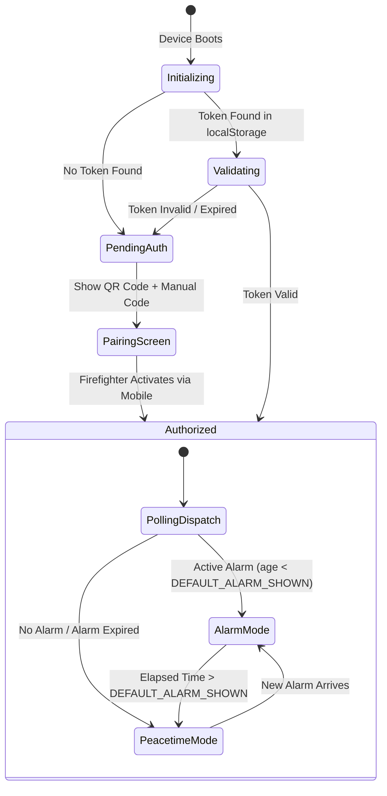
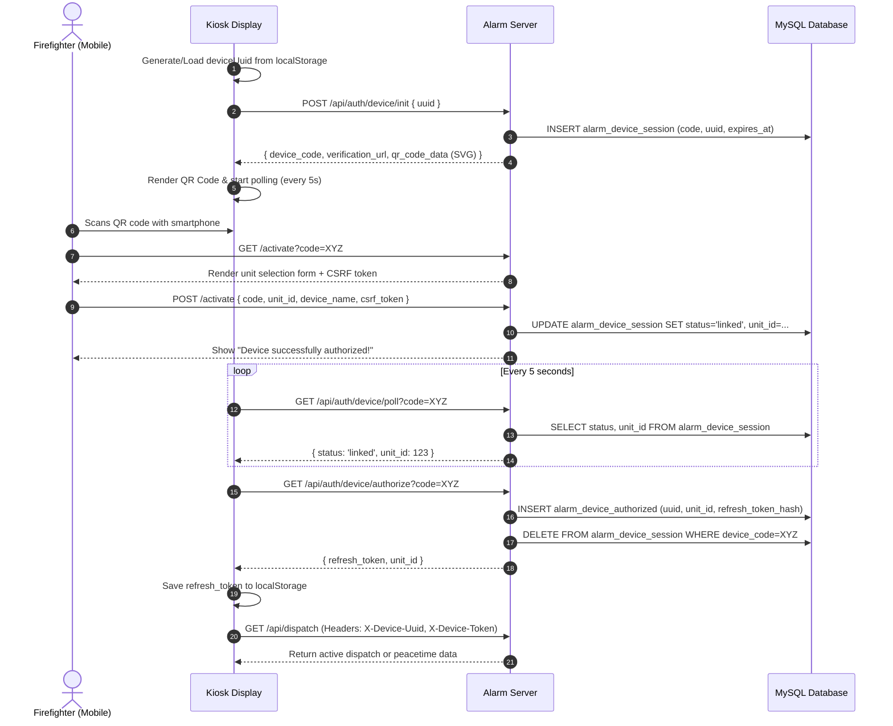
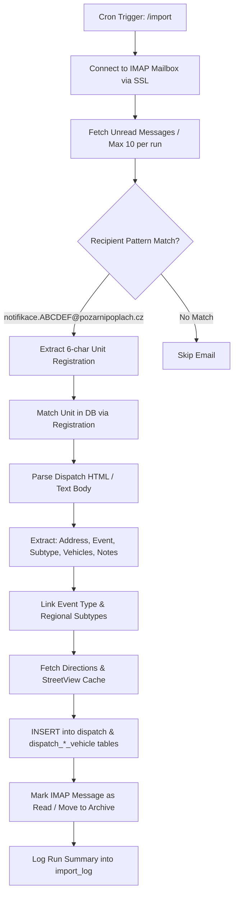
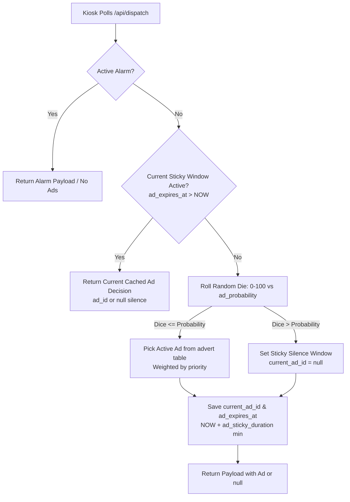
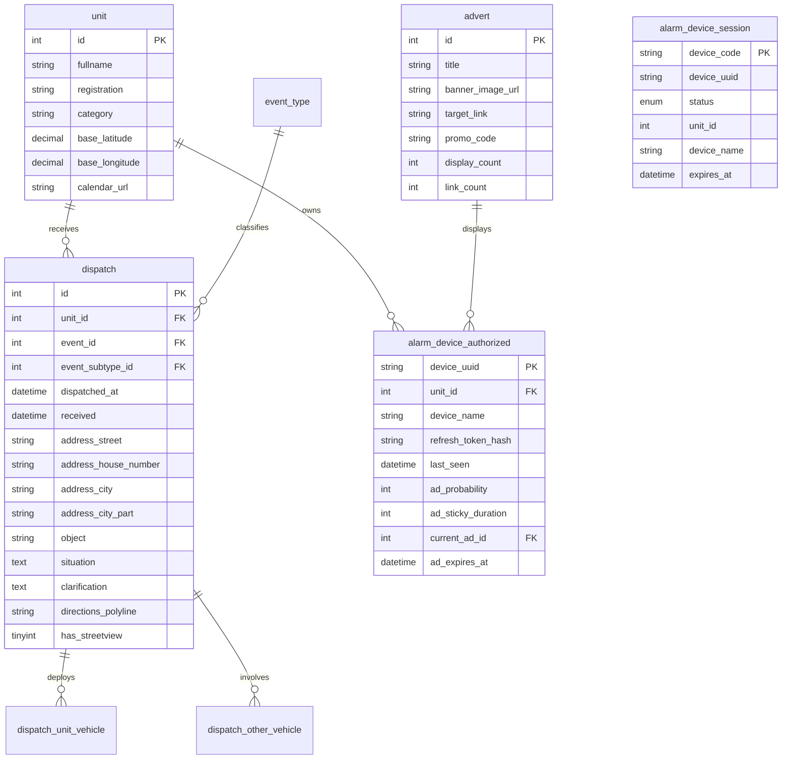

# Alarm.PozarniPoplach.cz — Comprehensive System & Application Specification
> **Dispatch Kiosk Monitor for Czech Volunteer & Municipal Fire Brigades (JSDH)**  
> Master documentation integrating Architecture, Design System, Process Flows, Operations, Frontend (FE), Backend (BE), Authentication (OAuth 2.0 Device Flow), and Onboarding Guidelines.

---

## 1. Executive Overview & Mission

### 1.1 Purpose & Real-World Context
**Alarm.PozarniPoplach.cz** is a mission-critical firehouse kiosk application built for volunteer fire brigade units (JSDH) in the Czech Republic. It is engineered to operate unattended 24/7 on a wall-mounted **Raspberry Pi 4** (or mini PC) driving a large display in the fire station garage without any keyboard or mouse attached.

When an emergency call is dispatched by the regional operations center (**KOPIS**), dispatch metadata is received via email, parsed by the system, and instantly projected onto the kiosk HUD:
- **Emergency classification and subtype** (e.g., *Požár — Lesní požár*, *Dopravní nehoda*).
- **Exact location and clarification** (address, house number, municipality, floor/object description, GPS).
- **Assigned unit vehicles** (callsigns, equipment types) and other responding units.
- **Real-time departure countdown timer** (alerting units to the statutory 10-minute departure limit).
- **Interactive tactical navigation** (route overview, map preview, Google Street View).

During peacetime (standby mode), the screen displays unit calendar schedules, training dates, operational status, and non-intrusive sponsor announcements.

### 1.2 Dual-Surface Ecosystem
The application consists of two distinct user-facing surfaces:
1. **The Kiosk HUD (`/`)** — A full-screen, high-contrast dark-mode dashboard tailored for visibility from across the vehicle bay.
2. **The Mobile Activation Surface (`/activate`)** — A responsive mobile web interface opened on a firefighter's smartphone to authenticate and link a newly installed kiosk screen to their brigade unit via QR code scanning.

---

## 2. Project Structure & Directory Layout

```
/
├── index.php                   # Main web entry point — dispatches all HTTP requests
├── inc.startup.php             # Bootstrap: Composer autoloader + Dotenv loading
├── inc.smarty.php              # Smarty template engine initialization & plugins
├── cron.email_import.php       # Standalone cron script: IMAP mailbox → database
├── composer.json               # PHP dependencies & platform configurations
├── composer.lock               # Locked PHP dependency graph
├── package.json                # Node.js dependencies (Tailwind CSS build tools)
├── .env                        # Production configuration (DB, IMAP, base URLs)
├── .env.localhost              # Local dev overrides (auto-loaded when server contains 'localhost')
│
├── include/
│   ├── routes.php              # All route definitions (loaded by index.php)
│   ├── class.Dispatch.php      # Dispatch data model, email parsing, Maps enrichment
│   ├── class.DeviceAuth.php    # OAuth 2.0 Device Flow implementation & token management
│   ├── class.Ad.php            # Advertisement engine ("sticky ad" rotation logic)
│   ├── class.Unit.php          # Fire brigade unit model & regional lookups
│   └── class.Calendar.php      # iCalendar / Google Calendar parser with SSRF validation
│
├── view/
│   ├── page/
│   │   ├── alarm.php           # Controller: main kiosk dashboard
│   │   ├── activate.php        # Controller: mobile activation & pairing page
│   │   └── goto.php            # Controller: ad redirection & click hit tracking
│   └── api/
│       ├── dispatch.php        # API: get latest dispatch data (auth required)
│       ├── version.php         # API: version hash for hot-reloading code updates
│       ├── calendar.php        # API: get upcoming calendar events (auth required)
│       ├── device-init.php     # API: start pairing session, return SVG QR code
│       ├── device-poll.php     # API: check pairing status (kiosk polls this)
│       ├── device-authorize.php# API: finalize pairing, issue refresh token
│       └── device-validate.php # API: validate existing refresh token
│
├── tpl/
│   ├── page.alarm.html         # Smarty template: full kiosk HUD (alarm + peacetime)
│   ├── page.activate.html      # Smarty template: mobile pairing form
│   ├── page.goto.html          # Smarty template: error page for invalid ad redirects
│   ├── page.404.html           # Smarty template: 404 page
│   └── app.conf                # Smarty configuration file
│
├── ui/
│   ├── alarm.css               # Tailwind source CSS (edit this)
│   ├── alarm.dist.css          # Compiled CSS artifact (do NOT edit directly)
│   ├── alpine.js               # Reactive Alpine.js frontend logic: alarmSystem()
│   ├── alpine.min.js           # Self-hosted Alpine.js vendor bundle
│   └── webfonts/
│       └── public-sans.woff2   # Self-hosted Public Sans variable font
│
├── assets/                     # Static audio cues (timer-start.mp3, timer-end.mp3)
│
└── tests/
    ├── Pest.php                # PestPHP test bootstrap & global helper mocks
    ├── Feature/                # Integration / endpoint tests
    │   ├── ActivatePageTest.php
    │   ├── CalendarApiTest.php
    │   ├── DeviceAuthFlowTest.php
    │   ├── DeviceInitTest.php
    │   ├── DispatchTest.php
    │   ├── GotoTest.php
    │   ├── RoutesTest.php
    │   └── VersionTest.php
    └── Unit/                   # Unit tests
        ├── AdTest.php
        ├── CalendarTest.php
        ├── DeviceAuthTest.php
        ├── DispatchTest.php
        └── UnitTest.php
```

---

## 3. Configuration (.env) & Environment Boot Flow

### 3.1 Environment Variables
The application is configured via `.env` at the project root. For local development, `.env.localhost` is auto-loaded when `$_SERVER['SERVER_NAME']` contains `localhost` (or CLI mode), overriding `.env` values.

```dotenv
# Application
ABSOLUTE_URL=https://alarm.pozarnipoplach.cz
DEBUGGING=0                  # 0=production (errors off), 1=debug on, 2=Smarty debug panel

# Database (MySQL / MariaDB)
SQL_HOST=localhost
SQL_DATABASE=pozarnipoplach
SQL_USER=alarm_user
SQL_PASSWORD=secret_password

# Smarty Cache & Templates
SMARTY_TEMPLATE_DIR=./tpl/
SMARTY_COMPILE_DIR=./tpl_c/

# IMAP Ingestion (for cron email import)
IMAP_HOSTNAME={imap.pozarnipoplach.cz:993/imap/ssl}INBOX
IMAP_USERNAME=notifikace@pozarnipoplach.cz
IMAP_PASSWORD=secret_imap_password

# Business Logic
DEFAULT_ALARM_SHOWN=60       # Minutes after dispatched_at to show alarm view before returning to peacetime
```

### 3.2 Application Boot Flow
Every web request is processed through [`index.php`](index.php):
1. **`inc.startup.php`:** Loads Composer autoloader and `.env` / `.env.localhost`. Enforces error reporting based on `DEBUGGING`.
2. **Global Context Setup:** Populates singleton `AppData::getInstance()` with allowed configuration parameters (`BASE_URL`, `APP`, etc.).
3. **Security Headers:** Sends `X-Frame-Options: DENY`, `X-Content-Type-Options: nosniff`, `Strict-Transport-Security`, `Referrer-Policy: no-referrer`, and `Permissions-Policy`.
4. **Session Startup:** Initializes session with strict parameters (`httponly`, `samesite=Lax`, name `pozarnipoplach_alarm`).
5. **Localization:** Sets timezone to `Europe/Prague` and internal encoding to `UTF-8`.
6. **Database Connection:** Instantiates `Janmensik\Jmlib\Database` and sets UTF-8 charset.
7. **Smarty Engine:** `inc.smarty.php` configures template/compile directories and plugins.
8. **Routing Execution:** `bramus/router` parses [`include/routes.php`](include/routes.php) and invokes the matched controller.
9. **Response Rendering:**
   - **API Routes (`$APPD->getData('API') === true`):** Outputs JSON response via `header('Content-Type: application/json')`.
   - **Page Routes:** Smarty compiles and displays the template corresponding to `$APPD->getData('PAGE')`.

---

## 4. Tactical Design System: "Kinetic Command"

### 4.1 Creative North Star & Philosophy
The design language rejects standard "SaaS app" conventions (soft pastels, generous rounded corners, low contrast) in favor of **Kinetic Command**: an authoritative, HUD-first aesthetic inspired by emergency vehicle markings (RAL 3000/3024) and tactical control panels.

- **Instant Glanceability:** Firefighters must absorb incident type, location, and dispatched vehicles in under 3 seconds.
- **Dark-First Immersion:** Deep obsidian base tones eliminate eye strain in darkened garages while allowing high-visibility emergency colors to command attention.
- **Hardware Aesthetic:** Sharp 0px corners, monospace coordinates, tabular digits, and CRT scanline textures create a dedicated instrument feel.

### 4.2 Color Palette & Design Tokens
Defined in [`ui/alarm.css`](ui/alarm.css) using Tailwind CSS v4 variables:

| Token | Hex Value | Role / Usage |
|---|---|---|
| `--color-surface` | `#09151a` | Void base background (deep dark-cyan obsidian) |
| `--color-on-surface` | `#d7e4ec` | High-contrast primary reading text |
| `--color-primary` | `#F80000` | Tactical emergency red — active alarms, critical urgency |
| `--color-primary-container` | `#AF2B1E` | Deep emergency red — alarm panels, active headers |
| `--color-on-primary-container` | `#ffffff` | Pure white text over primary containers |
| `--color-secondary` | `#FFD400` | Caution / Accent yellow — departure timer, attention cues |
| `--color-on-secondary` | `#402d00` | High-contrast dark text over yellow accents |
| `--color-tertiary` | `#c6c6c7` | Neutral gray — secondary telemetry, subtitles |
| `--color-error` | `#ffb4ab` | Error states and broken validation warnings |
| `--color-outline-variant` | `#5b403d` | Warm ghost dividers and subtle accents |
| `--color-surface-container-low` | `#111d23` | Recessed structural backgrounds |
| `--color-surface-container` | `#152127` | Standard card and telemetry backgrounds |
| `--color-surface-container-high` | `#202c32` | Elevated cards and prominent UI blocks |
| `--color-surface-container-highest` | `#2a363d` | Highest-elevation panels and input backgrounds |

### 4.3 Structural & Geometric Rules
- **The "No-Line" Rule:** 1px solid borders are prohibited for sectioning components. Boundaries are created exclusively through tonal shifts between container tiers (`surface` $\rightarrow$ `surface-container-low` $\rightarrow$ `surface-container-high`).
- **Sharp Industrial Geometry:** All standard components enforce a strict **0px border radius** (`--radius-default: 0px`, `--radius-md: 0px`, `--radius-lg: 0px`). Corners are sharp and utilitarian. The only exception is `--radius-full: 9999px`, reserved for status dots.
- **CRT Scanline Texture:** A CSS animation (`.scanline`) overlays a subtle horizontal gradient line cycling continuously over 10 seconds to simulate a hardware CRT monitor.
- **Typography:** **Public Sans** (self-hosted WOFF2 variable font in `ui/webfonts/public-sans.woff2`). Tabular numbers (`font-mono`) are enforced on clocks and timers to eliminate layout jitter.

---

## 5. User Experience & Screen Modes



### 5.1 Mode 1: Active Alarm (`dispatch_status: 'alarm'`)
Activated as soon as KOPIS dispatches the unit. Persists for `DEFAULT_ALARM_SHOWN` minutes (default: 60 min).
- **Incident Banner:** Emergency icon, event type, subtype, and clarification in heavy red headers.
- **Location Command:** Prominent street, house number, municipality, district, and building object notes.
- **Departure Countdown Timer:**
  - Displays elapsed time since dispatch (`MM:SS`).
  - Plays dispatch audio tone on first appearance.
  - Automatically triggers an audible warning at the statutory **10:00 limit** (`diff === 600`).
- **Tactical Vehicle Deployment:** Visual cards for designated unit vehicles (CAS, DA, etc.) showing callsigns, followed by other responding units.
- **Map & Telemetry:** Integrated navigation route overview and Street View imagery if available.

### 5.2 Mode 2: Peacetime Standby (`dispatch_status: 'peacetime'`)
When no alarm is active, the screen maintains operational awareness:
- Current digital clock with high-visibility second counter.
- Station banner with unit full name and readiness status.
- **Calendar Agenda Feed:** Upcoming firehouse shifts, training drills, youth firefighter meetings, and brigade events parsed from Google Calendar or iCal feeds.
- **Sticky Sponsor Ad:** Non-intrusive banner displaying support partner announcements, rotating according to device-configured probability.

### 5.3 Mode 3: Pairing Screen (`authStatus: 'pending'`)
Shown when a kiosk has not yet been authorized:
- Renders an ultra-sharp **SVG QR code** pointing to the device pairing URL (`/activate?code=XYZ`).
- Displays a high-contrast 8-character alphanumeric code for manual browser entry.
- Background polling loop automatically transitions the display the instant authorization completes on mobile.

---

## 6. End-to-End Process Flows

### 6.1 Zero-Touch Device Pairing (OAuth 2.0 Device Flow)



#### Detailed Phase Breakdown:
1. **Phase 1: Initialization**
   - The kiosk checks `localStorage` for `alarm_refresh_token`.
   - If missing, it generates a persistent hardware UUID (`crypto.randomUUID()`) and posts to `/api/auth/device/init`.
   - The server creates an `alarm_device_session` with an 8-character code (excluding ambiguous chars `0`, `O`, `1`, `I`) expiring in 5 minutes, generates an SVG QR code using `chillerlan/php-qrcode`, and returns `{ device_code, qr_code_data, verification_url }`.
2. **Phase 2: Polling**
   - The kiosk displays the QR code and polls `/api/auth/device/poll?code=XYZ` every 5 seconds.
3. **Phase 3: Unit Authorization (Mobile)**
   - Firefighter scans the QR code, opening `/activate?code=XYZ` on mobile.
   - The firefighter selects their unit and submits the form with CSRF validation.
   - The server sets `status = 'linked'` and records `unit_id` in `alarm_device_session`.
4. **Phase 4: Authorization & Completion**
   - On the next poll, the kiosk detects `linked` status and calls `/api/auth/device/authorize?code=XYZ`.
   - The server generates a random 64-character hex `refresh_token`, hashes it via `hash('sha256', $token)`, stores the hash in `alarm_device_authorized`, deletes the temporary session, and returns the raw token to the kiosk.
   - The kiosk stores the token in `localStorage` and begins fetching `/api/dispatch`.

---

### 6.2 Email Ingestion Pipeline (KOPIS $\rightarrow$ Database)

Operates via [`cron.email_import.php`](cron.email_import.php) executed periodically by system cron or the `/import` URL rewrite endpoint.



- **Email Address Pattern:** `notifikace.[A-Z0-9]{6}@pozarnipoplach.cz`. The 6-character alphanumeric string uniquely maps to `unit.registration`.
- **Google Maps Enrichment:** Distance polyline (`directions_polyline`), duration, and Street View availability (`has_streetview`) are resolved and cached in the database.
- **Safe HTML Parsing:** Ingests structured tables from regional KOPIS templates, extracting house numbers, street names, landmark objects, situation descriptions, and vehicle callsigns.

---

### 6.3 Peacetime Sticky Ad Delivery Engine

To prevent jarring visual flickers on garage displays, advertisement selection utilizes a **sticky decision window**:



- **Sticky Duration:** Configured per device in `alarm_device_authorized.ad_sticky_duration` (minutes).
- **Probability:** Configured per device in `alarm_device_authorized.ad_probability` (0–100%).
- **Click Tracking:** Links route through `/goto/ad/{id}`, which atomically increments `advert.link_count` before redirecting with HTTP 302.

---

## 7. Frontend Architecture

### 7.1 Alpine.js Component (`ui/alpine.js`)
The entire user interface is driven by a single reactive Alpine.js component: `alarmSystem(apiUrl, authBaseUrl, calendarUrl)`.

#### Core State Properties:
| Property | Type | Description |
|---|---|---|
| `isAuthorized` | `boolean` | Indicates if device has a valid, verified token |
| `authStatus` | `string` | `'initializing'`, `'pending'`, `'authorized'`, `'error'` |
| `deviceUuid` | `string` | Hardware UUID persisted in `localStorage` |
| `refreshToken` | `string` | Cryptographic pairing token persisted in `localStorage` |
| `data` | `object` | Dispatch payload from `/api/dispatch` |
| `calendarEvents` | `array` | Upcoming events parsed from unit iCal feed |
| `timerDisplay` | `string` | Formatted elapsed time (`MM:SS`) |
| `audioEnabled` | `boolean` | Browser audio playback availability |
| `appVersion` | `string` | Version hash received from `/api/version` |

#### Operational Intervals:
- **Clock & Alarm Ticker:** 1,000 ms (`setInterval`) updating both real-time clock and active dispatch counter.
- **Dispatch Polling:** 30,000 ms (`DISPATCH_POLL_INTERVAL_MS`).
- **Auth Polling:** 5,000 ms (`AUTH_POLL_INTERVAL_MS`) while in `'pending'` state.
- **Update Watchdog:** 600,000 ms (10 minutes) polling `/api/version`. Automatically invokes `window.location.reload(true)` when code updates are deployed.
- **24-Hour Safeguard:** Meta refresh tag (`content="86400"`) ensures fresh memory state daily.

#### Audio Alarm Subsystem:
Two audio cues are preloaded from `assets/`:
1. `alarm-sound-start` (`timer-start.mp3`): Plays immediately upon receipt of a new dispatch identifier.
2. `alarm-sound-limit` (`timer-end.mp3`): Plays at exactly 10 minutes (600 seconds) post-dispatch to signal the required turnout time.

---

## 8. Backend Architecture & REST APIs

### 8.1 Technology Stack & Platform Requirements
- **PHP Version:** PHP **8.2+** strictly supported (compatible with production PHP 8.2.33).
- **Template Engine:** Smarty 5 (`smarty/smarty ^5.4`).
- **Routing Engine:** Bramus Router (`bramus/router ^1.6`).
- **Base Framework:** Janmensik JmLib 2.0 (`janmensik/jmlib ^2.0`).
- **QR Engine:** Chillerlan PHP-QRCode 6 (`chillerlan/php-qrcode ^6.0`).
- **Calendar Parsing:** `johngrogg/ics-parser ^3.5`.
- **Testing:** Pest PHP 3.8 / PHPUnit 11 (`pestphp/pest ^3.8`).
- **Database:** MySQL 5.7+ / MariaDB 10.3+.

### 8.2 Routing Table
Defined in [`include/routes.php`](include/routes.php):

| Method | Path | Controller View | Description |
|---|---|---|---|
| `GET` | `/` | `view/page/alarm.php` | Main Kiosk HUD interface |
| `GET\|POST` | `/activate` | `view/page/activate.php` | Mobile pairing & unit selection form |
| `GET` | `/goto/(\w+)/(\d+)` | `view/page/goto.php` | Ad link redirection & hit counter |
| `GET` | `/api/dispatch` | `view/api/dispatch.php` | Dispatch data payload (auth required) |
| `GET` | `/api/version` | `view/api/version.php` | App git/assets version hash |
| `GET` | `/api/calendar` | `view/api/calendar.php` | Unit iCalendar events feed (auth required) |
| `GET\|POST` | `/api/auth/device/init` | `view/api/device-init.php` | Phase 1: Create session & generate QR |
| `GET` | `/api/auth/device/poll` | `view/api/device-poll.php` | Phase 2: Poll session status |
| `GET\|POST` | `/api/auth/device/authorize` | `view/api/device-authorize.php` | Phase 3: Finalize pairing, issue refresh token |
| `GET\|POST` | `/api/auth/device/validate` | `view/api/device-validate.php` | Phase 4: Validate stored refresh token |

### 8.3 Core Backend Models (`include/class.*.php`)
All classes reside in the `PozarniPoplach\` namespace and inherit from `Janmensik\Jmlib\Modul`:

- **`Dispatch` ([`include/class.Dispatch.php`](include/class.Dispatch.php)):**
  - `getLastDispatch(?int $unit_id)` — Fetches the most recent dispatch for a unit.
  - `getDispatch(int $dispatch_id)` — Returns full dispatch record including vehicles.
  - `beautifulLastDispatch(array $dispatch)` — Transforms raw DB rows into display-ready structures.
  - `parseDispatchHtml(string $html)` — Regex parser extracting fields from KOPIS emails.
- **`DeviceAuth` ([`include/class.DeviceAuth.php`](include/class.DeviceAuth.php)):**
  - `initSession(string $deviceUuid)` — Generates 8-char code and sets up temporary session.
  - `checkSessionStatus(string $deviceCode)` — Returns session status (`pending` / `linked`).
  - `linkSessionToUnit(string $deviceCode, int $unitId, ?string $deviceName)` — Mobile linking.
  - `authorizeDevice(string $deviceCode)` — Finalizes pairing, returns raw refresh token.
  - `validateDevice(string $deviceUuid, string $refreshToken)` — Validates token hash and updates `last_seen`.
  - `getRequestCredentials()` — Reads credentials from `X-Device-Token` / `X-Device-UUID` or `Authorization: Bearer`.
- **`Ad` ([`include/class.Ad.php`](include/class.Ad.php)):**
  - `getAdForDevice(string $deviceUuid, int $unitId)` — Evaluates sticky window and rolls probability dice.
  - `logLinkHit(int $adId)` — Increments click count.
- **`Calendar` ([`include/class.Calendar.php`](include/class.Calendar.php)):**
  - `getCalendar($sort, ?int $limit, ?string $max_ahead)` — Fetches and parses iCal feed with SSRF protection.
- **`Unit` ([`include/class.Unit.php`](include/class.Unit.php)):**
  - `getRegions()` — Returns all regions ordered by title.
  - `validate()` — Validates unit configuration fields.

### 8.4 API Response Schemas & Examples

#### `/api/dispatch` — Alarm Mode
```json
{
  "dispatch_status": "alarm",
  "event": "Požár",
  "event_subtype": "Lesní požár",
  "event_icon": "fa-solid fa-fire",
  "address_street": "Na Příkopě",
  "address_house_number": "12",
  "address_city": "Praha",
  "address_city_part": "Nové Město",
  "object": "Administrativní budova",
  "clarification": "3. patro, dým z oken",
  "situation": "Volná hořící plocha",
  "dispatched_at_ts": 1716120000,
  "unit_fullname": "JSDH Příbram",
  "unit_vehicles": [
    { "fullname": "CAS 20 Tatra 815", "type": "CAS", "code": "PBA 101" }
  ],
  "other_vehicles": [
    { "fullname": "CAS 30 Scania HZS", "type": "CAS", "code": "HZS 01" }
  ],
  "directions_polyline": "a~l~Fjk~uOw...",
  "has_streetview": 1
}
```

#### `/api/dispatch` — Peacetime Mode
```json
{
  "dispatch_status": "peacetime",
  "unit": "JSDH Příbram",
  "ad": {
    "id": 5,
    "banner_image_url": "https://alarm.pozarnipoplach.cz/assets/banner.png",
    "target_link": "https://alarm.pozarnipoplach.cz/goto/ad/5",
    "ad_text": "Hasičská technika a výstroj",
    "promo_code": "HASICI10"
  }
}
```

#### `/api/calendar`
```json
[
  {
    "title": "Školení dýchací techniky",
    "start": "2026-10-05T18:00:00+02:00",
    "end": "2026-10-05T20:00:00+02:00",
    "location": "Hasičská zbrojnice Příbram",
    "link": "",
    "description": "Pravidelná údržba a přezkoušení nositelů DT",
    "status": "CONFIRMED"
  }
]
```

---

## 9. Database Schema Reference



---

## 10. Raspberry Pi 4 Kiosk Deployment & Operations

### 10.1 OS & Hardware Setup
- **Recommended Hardware:** Raspberry Pi 4 Model B (2 GB+ RAM) connected via HDMI to a commercial TV or monitor.
- **Operating System:** Raspberry Pi OS Lite (or Full) with X11 / Openbox or Wayland.
- **Display Orientation:** For vertical orientation, configure `/boot/cmdline.txt` or `xrandr --output HDMI-1 --rotate right`.

### 10.2 Production Chromium Launcher Script
Create `/home/pi/kiosk.sh` (executable via `chmod +x`):
```bash
#!/bin/bash
xset s noblank
xset s off
xset -dpms

# Hide mouse cursor when inactive
unclutter -idle 0.5 -root &

# Launch Chromium in dedicated hardened kiosk profile
sed -i 's/"exited_cleanly":false/"exited_cleanly":true/' ~/.config/chromium/Default/Preferences
sed -i 's/"exit_type":"Crashed"/"exit_type":"Normal"/' ~/.config/chromium/Default/Preferences

/usr/bin/chromium-browser \
  --kiosk \
  --incognito \
  --noerrdialogs \
  --disable-infobars \
  --disable-session-crashed-bubble \
  --disable-features=Translate,TranslateUI,InfiniteSessionRestore \
  --autoplay-policy=no-user-gesture-required \
  --check-for-update-interval=604800 \
  --overscroll-history-navigation=0 \
  --disable-pinch \
  --password-store=basic \
  --no-first-run \
  https://alarm.pozarnipoplach.cz/
```

### 10.3 Systemd Autostart Service
Create `/etc/systemd/system/kiosk.service`:
```ini
[Unit]
Description=Firehouse Kiosk Display
After=network-online.target
Wants=network-online.target

[Service]
Type=simple
User=pi
Environment=DISPLAY=:0
ExecStartPre=/bin/sleep 5
ExecStart=/home/pi/kiosk.sh
Restart=always
RestartSec=10

[Install]
WantedBy=graphical.target
```

---

## 11. Security, Reliability & Maintenance Audit

### 11.1 Implemented Hardening Measures
- **Self-Hosted Core Assets:** Fonts (`public-sans.woff2`) and scripts (`alpine.min.js`) are hosted locally to remove external CDN failure modes.
- **HTTP Caching & Asset Hashing:** Static assets carry `Cache-Control: public, max-age=86400, immutable` with version query strings (`?v={$assetsVersion}`).
- **Security Headers:** Enforced in [`index.php`](index.php):
  - `X-Content-Type-Options: nosniff`
  - `X-Frame-Options: DENY`
  - `Strict-Transport-Security: max-age=63072000; includeSubDomains; preload`
  - `Referrer-Policy: no-referrer`
  - `Permissions-Policy: geolocation=(), microphone=(), camera=()`
- **PHP 8.2 Target Pinning:** [`composer.json`](composer.json) enforces `"platform": { "php": "8.2.33" }`, guaranteeing that updates never pull packages requiring PHP 8.4+ syntax onto the production server.
- **Comprehensive Test Suite:** 94 Pest PHP tests cover the entire matrix: dispatch API states, OAuth device flow sequence, iCal calendar parser, ad rotation logic, and URL routing.

### 11.2 Ongoing Backlog & Future Optimizations
1. **Server-Sent Events (SSE):** Replace 30-second interval polling on `/api/dispatch` with an SSE stream (`/api/dispatch/stream`) to reduce server load and achieve sub-second dispatch propagation.
2. **Offline Service Worker:** Implement a browser service worker to cache application shells and render the last-known dispatch state during local internet dropouts.
3. **Flock on Email Cron:** Ensure overlapping cron jobs do not process duplicate messages by implementing file-based mutex locking in `cron.email_import.php`.
4. **Heartbeat Telemetry Alert:** Configure server-side monitoring to notify brigade commanders if a registered kiosk has not refreshed its `last_seen` timestamp for > 15 minutes.

---

## 12. Local Development, Testing & Release Process

### 12.1 Local Development Checklist
1. Copy `.env` and fill in database and IMAP credentials.
2. Run `composer install`.
3. Run `npm install` and `npm run dev` to compile Tailwind CSS (`ui/alarm.css` $\rightarrow$ `ui/alarm.dist.css`).
4. Ensure `tpl_c/` exists and is writable by PHP.
5. Point virtual host document root to project root (`index.php`).
6. Run Pest tests: `./vendor/bin/pest`.

### 12.2 Release Process
```bash
# 1. Run all tests
./vendor/bin/pest

# 2. Validate composer configuration
composer validate

# 3. Create semantic version tag
git tag 0.x.y
git push origin 0.x.y
git push
```

### 12.3 FTP / Production Deployment Note
Because production does not run Composer CLI directly and receives files via FTP:
- Always run `composer update` locally with `"platform": { "php": "8.2.33" }` configured in `composer.json`.
- Upload the updated `vendor/` directory along with `composer.json` and `composer.lock`.

---

## 13. Common Gotchas & Architectural Rules

- **`alarm.dist.css` is a build artifact:** Never edit `ui/alarm.dist.css` directly. Edit `ui/alarm.css` and compile using `npm run build`.
- **`ui/alpine.js` is the frontend logic:** It is a locally served script, not a bundled build artifact. Changes take effect immediately upon page reload.
- **Smarty compile cache:** If template edits do not appear, clear `tpl_c/`. `compile_check` is enabled when `DEBUGGING=1`.
- **Session Name:** The session name is strictly `pozarnipoplach_alarm` (not the PHP default).
- **`DEFAULT_ALARM_SHOWN`:** Defines the duration (in minutes) an alarm remains visible on the HUD before automatically returning to peacetime mode.
- **CSRF Token:** The `/activate` page requires CSRF validation stored in `$_SESSION['csrf_token']`.
- **Refresh Token Storage:** Refresh tokens are stored as SHA-256 hashes in `alarm_device_authorized`. The raw token is sent only once upon authorization.
