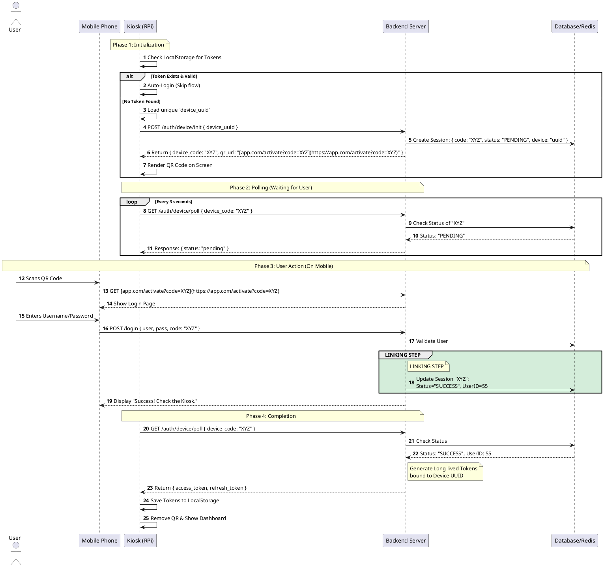

# Kiosk Authentication Architecture (OAuth 2.0 Device Flow)

## Overview
This document outlines the authentication architecture for the Kiosk application (running on a Raspberry Pi without a keyboard). To authenticate, the Kiosk utilizes a "Cross-Device Authentication" pattern (similar to the OAuth 2.0 Device Flow). 

The Kiosk displays a unique QR code. The user scans this code with their mobile device, logs in on their phone, and the server links the user's session to the Kiosk.

## Technology Stack
*   **Frontend (Kiosk):** HTML / Alpine.js
*   **Backend:** PHP / REST API (returns JSON)
*   **Database/Cache:** Redis or SQL (for temporary session storage)

---

## The Authentication Flow

The process is divided into four main phases:

### Phase 1: Initialization
When the Kiosk boots, it checks local storage for an existing `refresh_token`.
*   **If a valid token exists:** Auto-login.
*   **If no token exists:** The Kiosk generates/loads a persistent hardware ID (`device_uuid`) and asks the backend for a login session. The backend returns a short-lived `device_code` and a `qr_url`. The Kiosk renders the QR code.

### Phase 2: Polling
Since the Kiosk is essentially "blind" to the user's phone, it must repeatedly ask the server if the login is complete. It polls the server every 3 seconds using the `device_code`.

### Phase 3: User Action (Mobile)
The user scans the QR code, opening a webpage on their phone. They log in using their credentials. The backend takes the authenticated `user_id` and attaches it to the pending session associated with the `device_code`.

### Phase 4: Completion
On the next poll, the Kiosk receives a `SUCCESS` status along with a short-lived `access_token` and a long-lived `refresh_token`. It saves the `refresh_token` to `localStorage` (bound to its `device_uuid`) and redirects to the dashboard.

---

## Sequence Diagram

[PlantUML sequence diagram](https://editor.plantuml.com/uml/dLLjJnf14Fw-ls9wJGmcMDAgNqXi5OuQ8bNAITzYeilT01kFtNDt3sjD_tjdTq7bW3OfdtQNPzwUUMRks5YkRJdB6I-jakLiX9endbgb8HeQr15m0-x02WAAL1HSMeW-gP784VfJ9T53miCgw4meSmkrGL_iUeo_hq9QFBr5cK62Uhu85ewhi9XRFk866mFCXF6mkCMOL1P14JguRb8-18AtJUXAOGNFnIzkXPACXLJstY-1xIccjz1JASyJgfLF4CPKygMYR0pZkGr7wFmKnXhOWI_aB6D0lwgh4o9khwScGa8jkHK5Z7DrlyimfqpErSBFHrNApUOznJCefRWh4Muod8iKhyjIP3UhwC0ALNYHN4A3cZLj1713KAdm22zCuRUt3IREE6vHnHeviPMWCSH8aonIbM4Jec_VVqHr81tOqj2rtpcFk-Udz1GyqfFp6LMSFXSmG5jg-Pp1YjixVLtgdAwyADwaQjOWQOav9VB1mOuSQE6uoik0P461FW-WJKXG4f9K8qf6xskThp_punNmZWugpuMSGEqh9odGmVNN2NcNiLof0Zg4Vu1zC9WgcPdDT9zsAcmNv7PZhPj9zp9BFBUWnW7fSN7BSxYCarJftqgsAPGqwFhtrBA2AA4ANGeLSbozTPz9u6M_wP_W97LZ0RKBkHXS8iN_GP720wMKSccM_BF5m5UesTfLzYBr9uTJTGzXKFeqS6i1EzAY3ij6yXas-joOUwMp3R735EJUroEKlig2u7LOxSXgD_mCko7m-unDj2eBU1qVTEBu17hTypCY7fBBJj-JxrdKOZArhdFBo6kmrH338dinPI6FvfKCxJsAac6xtKaI6WoNGZS-EZmCBTj0LonCaVC7Y98oJSdVguMQx1I36jv4_vo30vAWcXKvLhRWVybxkxJPDZLNwsq25SmsCtkA4hKZhwVaP2yNSymM-_XAZjpw1AiWzed1SDYDsLzM4VUCNLjdNWUDOurc6gvKoDhN8E5pNCHoGLv-5jQm0vmHtsukTeAYOswc8yL9fyVKIlgK_W40)



---

## Implementation Pseudocode

### 1. Frontend Logic (Alpine.js Concept)

The Kiosk frontend handles state reactively. When the `status` changes, the UI updates automatically.

```javascript
// Alpine.js Component Pseudocode
function kioskAuth() {
    return {
        status: 'initializing', // 'initializing', 'pending', 'success'
        deviceUuid: getOrGenerateUUID(),
        deviceCode: null,
        qrUrl: null,

        async init() {
            // 1. Check for existing session
            if (hasValidToken(this.deviceUuid)) {
                this.status = 'success';
                this.loadDashboard();
                return;
            }

            // 2. Request new QR session
            let response = await api.post('/auth/device/init', { uuid: this.deviceUuid });
            this.deviceCode = response.device_code;
            this.qrUrl = response.qr_url;
            this.status = 'pending';
            
            // 3. Start Polling
            this.startPolling();
        },

        startPolling() {
            let interval = setInterval(async () => {
                if (this.status === 'success') {
                    clearInterval(interval);
                    return;
                }

                let pollRes = await api.get('/auth/device/poll', { code: this.deviceCode });
                
                if (pollRes.status === 'SUCCESS') {
                    saveTokens(pollRes.access_token, pollRes.refresh_token);
                    this.status = 'success';
                    this.loadDashboard();
                }
            }, 3000); // Poll every 3 seconds
        }
    }
}
```

### 2. Backend Logic (PHP / API Concept)

The backend handles the state of the session and links the Kiosk request with the Mobile user.

```php
// Endpoint 1: POST /auth/device/init (Called by Kiosk)
function initDeviceLogin(Request $req) {
    $deviceUuid = $req->input('device_uuid');
    $deviceCode = generateRandomString(16); // e.g., "XYZ-123"
    
    // Save to DB/Redis with a 5-minute expiration
    DB::insert('device_sessions', [
        'code' => $deviceCode,
        'device_uuid' => $deviceUuid,
        'status' => 'PENDING',
        'user_id' => null
    ]);

    return JSON([
        'device_code' => $deviceCode,
        'qr_url' => "[https://app.com/activate?code=](https://app.com/activate?code=)" . $deviceCode
    ]);
}

// Endpoint 2: GET /auth/device/poll (Called by Kiosk)
function pollDeviceStatus(Request $req) {
    $deviceCode = $req->input('device_code');
    $session = DB::find('device_sessions', $deviceCode);

    if ($session->status === 'SUCCESS') {
        // Generate tokens bound to the specific hardware UUID
        $tokens = generateTokens($session->user_id, $session->device_uuid);
        
        // Clean up the temporary session
        DB::delete('device_sessions', $deviceCode); 
        
        return JSON(['status' => 'SUCCESS', 'tokens' => $tokens]);
    }

    return JSON(['status' => 'PENDING']);
}

// Endpoint 3: POST /activate (Called by Mobile Phone)
function processMobileLogin(Request $req) {
    $username = $req->input('username');
    $password = $req->input('password');
    $deviceCode = $req->input('code');

    $user = authenticateUser($username, $password);
    
    if ($user) {
        // LINKING STEP: Attach the User ID to the Kiosk's session
        DB::update